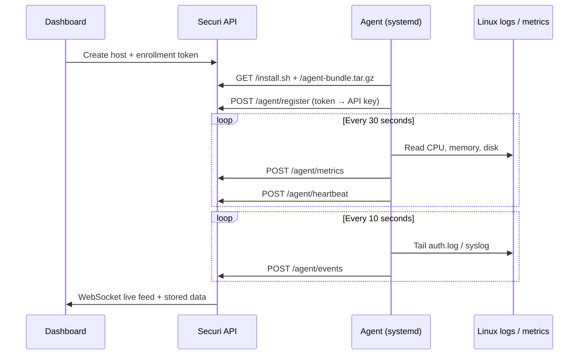

# Agent Installation & Host Monitoring

This guide explains how to add a host in the Securi dashboard, install the monitoring agent on a Linux server, and how the full pipeline works.

## Prerequisites

| Requirement | Details |
|-------------|---------|
| Securi server | Backend API reachable from target host (port 8000 or HTTPS via reverse proxy) |
| Target host | Ubuntu 20.04+ or Debian (apt-based) |
| Dashboard access | Admin or Analyst role to create hosts and enrollment tokens |
| Network | Target host can reach `SERVER_URL` (outbound HTTP/HTTPS) |

Set `SERVER_URL` in your server `.env` to the **URL agents use to connect** — not `localhost` if agents run on other machines.

```env
SERVER_URL=http://YOUR_SERVER_IP:8000
FRONTEND_URL=http://YOUR_SERVER_IP:3000
```

For HTTPS with Caddy/nginx, use your public domain for both:

```env
SERVER_URL=https://securi.yourdomain.com
FRONTEND_URL=https://securi.yourdomain.com
```

---

## Step 1 — Add a host in the dashboard

1. Log in to the dashboard.
2. Open **Hosts** in the sidebar.
3. Enter a name (e.g. `web-server-01`) and click **Add host**.

The host is created with status **offline** and agent **Pending**. This is normal — no agent is installed yet.

---

## Step 2 — Generate an enrollment token

1. In the hosts table, click **Enroll** on the new host.
2. A modal shows:
   - **Install command** — one-liner to run on the target server
   - **Enrollment token** — valid for 24 hours
3. Click the copy buttons to copy the command or token.

The install command looks like:

```bash
curl -fsSL http://YOUR_SERVER:8000/install.sh | sudo bash -s -- \
  --token enroll_xxxxxxxx \
  --server http://YOUR_SERVER:8000
```

---

## Step 3 — Install the agent on the Linux host

SSH into the target machine and run the install command as **root**:

```bash
curl -fsSL http://YOUR_SERVER:8000/install.sh | sudo bash -s -- \
  --token enroll_YOUR_TOKEN \
  --server http://YOUR_SERVER:8000
```

### What the installer does

1. Installs Python 3 and dependencies via `apt`
2. Downloads the agent bundle from `{SERVER}/agent-bundle.tar.gz`
3. Creates a virtualenv at `/opt/securi-agent`
4. Calls `POST /api/v1/agent/register` with the enrollment token
5. Saves API key to `/etc/securi/config.json` (mode 600)
6. Installs and starts `securi-agent` systemd service

### Verify on the host

```bash
sudo systemctl status securi-agent
sudo journalctl -u securi-agent -f
```

You should see: `Securi agent started for http://...`

---

## Step 4 — Confirm in the dashboard

Within ~30 seconds:

| Column | Expected value |
|--------|----------------|
| Agent | **Enrolled** |
| Hostname | Real hostname from the VM |
| Status | **online** |
| Last seen | Recent timestamp |

Data will appear in **Events**, **Metrics**, and the main **Dashboard**.

---

## How monitoring works



### Agent → server endpoints

| Endpoint | Interval | Purpose |
|----------|----------|---------|
| `POST /api/v1/agent/heartbeat` | 30s | Keep-alive, integrity hash, online status |
| `POST /api/v1/agent/metrics` | 30s | CPU, memory, disk, network, load |
| `POST /api/v1/agent/events` | 10s | SSH logins, sudo, service failures |

### Server-side processing

1. **Events** — parsed, deduplicated, MITRE-enriched, stored in PostgreSQL
2. **Detection rules** — brute force, high CPU, service failure, etc.
3. **Correlation** — builds attack timelines and offenses
4. **Threat scores** — per-host risk ranking
5. **WebSocket** — real-time updates to the dashboard live feed

### Host status logic

| Status | Meaning |
|--------|---------|
| **offline** | Host created but agent not enrolled, OR enrolled agent not yet connected |
| **online** | Agent heartbeating within last 90 seconds, no serious alerts |
| **warning** | Open high/medium alerts |
| **critical** | Open critical alerts or agent silent > 90 seconds (enrolled hosts only) |

Hosts without an enrolled agent are never marked **critical** — only **offline**.

---

## Re-enrolling or moving an agent

1. Click **Re-enroll** on the host in the dashboard.
2. Run the new install command on the target machine.

A new enrollment token invalidates the previous API key when registration completes.

---

## Troubleshooting

| Problem | Solution |
|---------|----------|
| `Failed to download agent bundle` | Ensure `SERVER_URL` is correct and `/agent-bundle.tar.gz` is reachable: `curl -I $SERVER_URL/agent-bundle.tar.gz` |
| `Registration failed: Invalid token` | Token expired (24h), already used, or revoked — generate a new one |
| `401` on agent requests | Re-enroll; old API key was rotated |
| Host stays **Pending** | Install did not complete — check `journalctl -u securi-agent` |
| Host **offline** after install | Firewall blocking outbound to API; wrong `--server` URL |
| No events | Ensure SSH/auth logging goes to `/var/log/auth.log`; agent needs root for log access |
| CORS / login issues | `FRONTEND_URL` must match the browser URL exactly |

### Manual checks from the target host

```bash
# Can reach API?
curl -fsSL http://YOUR_SERVER:8000/health

# Agent config
sudo cat /etc/securi/config.json

# Agent logs
sudo journalctl -u securi-agent -n 100 --no-pager
```

### Uninstall agent

```bash
sudo systemctl stop securi-agent
sudo systemctl disable securi-agent
sudo rm -f /etc/systemd/system/securi-agent.service
sudo rm -rf /opt/securi-agent /etc/securi /var/lib/securi
sudo systemctl daemon-reload
```

Delete the host from the dashboard if you no longer want to monitor it.

---

## Security notes

- Enrollment tokens are single-use and expire in 24 hours.
- API keys are stored hashed on the server; only shown once at registration.
- Agent config at `/etc/securi/config.json` is readable only by root.
- For production, set `ALLOW_REGISTRATION=false` and use HTTPS.
- Optional: enable `AGENT_REQUEST_SIGNING=true` on server and `signing_enabled: true` in agent config for HMAC request signing.

---

## Related docs

- [DEPLOYMENT.md](DEPLOYMENT.md) — Server hosting on Linux, Docker, HTTPS
- [API.md](API.md) — Full API reference
- [SCHEMA.md](SCHEMA.md) — Database schema
