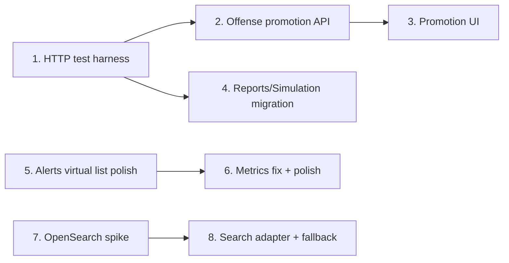

# Next Sprint Plan — SecuriSphere

**Duration:** 2 weeks (10 working days)  
**Goal:** Close the investigation workflow gap, harden frontend data layer, add real API tests, and validate OpenSearch as the search backend.

---

## Current Baseline (as of sprint start)

| Item | Status | Notes |
|------|--------|-------|
| Offense → incident promotion | ❌ Not started | No API; offenses and incidents are disconnected in UI |
| Virtualized alerts | ✅ Mostly done | `VirtualList` + `@tanstack/react-virtual` already in `alerts/page.tsx` |
| Metrics → TanStack Query | ⚠️ Partial | Uses `useQuery` but **missing import** — page may not compile |
| Reports → TanStack Query | ❌ Not started | Still `useEffect`; PDF/CSV uses **broken** `localStorage` token |
| Simulation → TanStack Query | ❌ Not started | Still `useEffect` |
| HTTP integration tests | ❌ Not started | `test_rbac.py` is doc-style unit tests only; no `conftest.py` |
| OpenSearch | ❌ Not started | `/search` and `/search/siem` hit PostgreSQL (`ILIKE`) |

---

## Recommended Execution Order



**Rationale:** Build the test harness first so promotion + RBAC tests land with the feature. Frontend migrations are parallelizable after day 2. OpenSearch is isolated and can run in parallel from day 5.

---

## Workstream 1 — Offense → Incident Promotion

**Problem:** Analysts can view offenses and create incidents separately, but cannot promote an offense into a tracked investigation with linked alerts.

### Backend

| Task | File(s) | Detail |
|------|---------|--------|
| Add promote endpoint | `backend/app/routers/offenses.py` | `POST /offenses/{id}/promote-to-incident` |
| Service logic | `backend/app/services/incident_promotion.py` *(new)* | Single transaction: create incident, link alerts, optional note, audit log |
| Idempotency | Same | If offense already promoted, return existing `incident_id` (add `offenses.incident_id` FK **or** query `incident_alerts` + title match — prefer explicit FK) |
| Schema (optional but recommended) | `backend/app/models/siem.py`, `migrate.py` | `Offense.incident_id UUID FK nullable` — avoids duplicate promotions |
| Audit | `backend/app/services/audit.py` | `offense_promoted_to_incident` |

**Promotion logic (spec):**

```
Input: offense_id
Output: { incident_id, linked_alert_count, created: bool }

1. Load offense + links (selectinload)
2. If offense.incident_id → return existing incident (created: false)
3. Create Incident:
   - title: "Offense #{offense_number}: {title}"
   - description: offense.description + timeline summary
   - severity: map risk_level → incident severity
   - host_id: offense.host_id
   - status: "investigating"
4. For each OffenseEvent with alert_id → IncidentAlert (skip duplicates)
5. Add IncidentNote: "Promoted from offense #{n} at {ts}"
6. Set offense.status = "investigating"
7. Set offense.incident_id = incident.id
8. log_audit(...)
9. Commit
```

**RBAC:** `require_roles("admin", "analyst")` — same as offense status PATCH.

### Frontend

| Task | File(s) | Detail |
|------|---------|--------|
| Promote button | `frontend/app/(dashboard)/offenses/page.tsx` | In detail panel: "Open investigation" |
| Mutation + toast | Same | `useMutation` → redirect to `/incidents?selected={id}` |
| Deep link | `frontend/app/(dashboard)/incidents/page.tsx` | Support `?selected=` like offenses page |
| Trail update | `frontend/components/InvestigationTrail.tsx` | Pass `incidentId` when known |

### Acceptance criteria

- [ ] Analyst clicks promote on offense → incident created with all linked alerts
- [ ] Second click returns same incident (no duplicate)
- [ ] Viewer role gets 403
- [ ] Investigation trail links to new incident
- [ ] Integration test covers happy path + RBAC

**Estimate:** 1.5 days

---

## Workstream 2 — Virtualized Alerts (Polish)

**Status:** Core implementation exists. Sprint work is verification + UX hardening.

| Task | File(s) | Detail |
|------|---------|--------|
| Fix dynamic height | `frontend/app/(dashboard)/alerts/page.tsx` | Use fixed viewport height (`min(720px, calc(100vh - 280px))`) instead of `items.length * 96` — avoids layout jump |
| Variable row heights (optional) | `frontend/components/VirtualList.tsx` | Add `measureElement` ref for rows with long descriptions |
| Loading overlay | `alerts/page.tsx` | Keep `isFetching` opacity; ensure scroll position stable on page change |
| Perf check | — | 500 rows: scroll stays 60fps; React DevTools shows only ~10 mounted rows |

### Acceptance criteria

- [ ] Page size 100+ scrolls smoothly
- [ ] Filter/page change does not reset scroll awkwardly
- [ ] No regression in status mutation or pagination

**Estimate:** 0.5 day

---

## Workstream 3 — Migrate Metrics / Reports / Simulation to TanStack Query

### 3a Metrics (fix + polish)

| Task | File(s) | Detail |
|------|---------|--------|
| Fix import | `frontend/app/(dashboard)/metrics/page.tsx` | Add `import { useQuery } from "@tanstack/react-query"` |
| Design system | Same | `PageHeader`, `Panel`, `input-siem`, skeleton while loading |
| Reuse hook | `frontend/lib/hooks/useApiQuery.ts` | Replace inline hosts query with `useHostsList()` |
| Remove dead code | Same | Drop unused `useCallback` if any |

### 3b Reports (full migration)

| Task | File(s) | Detail |
|------|---------|--------|
| Summary query | `frontend/app/(dashboard)/reports/page.tsx` | `useQuery({ queryKey: ["reports","summary"], ... })` |
| Download helper | `frontend/lib/download.ts` *(new)* | `downloadBlob(path)` with `credentials: "include"` — **remove localStorage** |
| Export mutation | `reports/page.tsx` | `useMutation` for PDF/CSV with loading state + error toast |
| Design system | Same | `PageHeader`, `Panel`, stat cards match dashboard |

### 3c Simulation (full migration)

| Task | File(s) | Detail |
|------|---------|--------|
| Hosts query | `frontend/app/(dashboard)/simulation/page.tsx` | `useHostsList()` |
| Scenarios query | Same | `useQuery(["simulation","scenarios"], ...)` |
| Run mutation | Same | `useMutation` POST; invalidate alerts/events queries on success |
| Disabled state | Same | Show banner if `GET /settings/public` has `simulation_enabled: false` |
| Design system | Same | `PageHeader`, admin-only note |

### Acceptance criteria

- [ ] No `useEffect` for data fetching on these three pages
- [ ] Reports PDF/CSV download works with cookie auth only
- [ ] Simulation run shows toast + refreshes alert list
- [ ] `tsc --noEmit` clean

**Estimate:** 1.5 days

---

## Workstream 4 — HTTP Integration Tests (Auth + RBAC)

**Problem:** `backend/tests/test_rbac.py` asserts Python sets, not HTTP behavior. No test client harness exists.

### Infrastructure

| Task | File(s) | Detail |
|------|---------|--------|
| Test DB config | `backend/tests/conftest.py` *(new)* | `TEST_DATABASE_URL` or reuse dev DB with transaction rollback |
| App fixture | Same | `httpx.AsyncClient` + `ASGITransport(app=app)` |
| Lifespan override | Same | Skip scheduler/WS in tests (`ENVIRONMENT=test`) |
| Seed fixtures | `backend/tests/fixtures/users.py` *(new)* | admin, analyst, viewer users + roles |
| Auth helper | `backend/tests/conftest.py` | `login(client, email, password) -> cookies` |

**Recommended approach:**

```python
# conftest.py sketch
@pytest.fixture
async def client():
    async with AsyncClient(transport=ASGITransport(app=app), base_url="http://test") as ac:
        yield ac

@pytest.fixture
async def admin_client(client):
    await login(client, "admin@test.local", "testpass")
    return client
```

Use a dedicated test database (`securi_test`) — run `migrate_schema` once per session.

### Test cases

| Test file | Cases |
|-----------|-------|
| `backend/tests/integration/test_auth.py` | login 200 + Set-Cookie; wrong password 401; refresh; logout clears cookie; lockout after N failures |
| `backend/tests/integration/test_rbac_http.py` | viewer 403 on offense PATCH, incident POST, export, simulation; analyst 200 on offense PATCH; admin 200 on audit |
| `backend/tests/integration/test_offense_promotion.py` | promote creates incident + links; idempotent second call |

### CI

| Task | File | Detail |
|------|------|--------|
| Test DB service | `.github/workflows/ci.yml` | Add Postgres service; set `DATABASE_URL` + `JWT_SECRET` |
| Run integration | Same | `pytest tests/integration -q` |

### Acceptance criteria

- [ ] ≥12 HTTP tests passing in CI
- [ ] Tests do not depend on running dev server
- [ ] Cookie-based auth tested end-to-end

**Estimate:** 2 days

---

## Workstream 5 — OpenSearch Spike for `/search`

**Goal:** Prove OpenSearch can replace PostgreSQL ILIKE for global + SIEM search without breaking existing API contract.

### Phase A — Spike (this sprint)

| Task | File(s) | Detail |
|------|---------|--------|
| Docker service | `docker-compose.yml` | `opensearch:2.x` single-node + `DISABLE_SECURITY_PLUGIN=true` (dev only) |
| Config | `backend/app/config.py` | `opensearch_url: str = ""`, `search_backend: Literal["postgres","opensearch"] = "postgres"` |
| Index mapping | `backend/app/search/mappings.py` *(new)* | `events`, `alerts`, `hosts` indices with timestamp + keyword fields |
| Indexer (minimal) | `backend/app/search/indexer.py` *(new)* | `index_event(event)`, `bulk_index_events` |
| Hook ingestion | `backend/app/pipeline/ingestion.py` | After event insert, async index if OpenSearch enabled |
| Search adapter | `backend/app/search/client.py` *(new)* | `SearchBackend` protocol with `postgres` + `opensearch` impl |
| Router switch | `backend/app/routers/search.py` | Delegate to adapter; same response shape |
| Backfill script | `backend/scripts/backfill_opensearch.py` *(new)* | One-time index from Postgres (limit 10k for spike) |
| Spike doc | `docs/OPENSEARCH_SPIKE.md` *(new)* | Benchmarks, index design, go/no-go |

### SIEM query mapping (spike scope)

| SIEM token | OpenSearch |
|------------|------------|
| `host:web01` | `term` / `match` on `host.name` |
| `severity:critical` | `term` on `severity` |
| `event_type:failed_login` | `term` on `event_type` |
| free text | `multi_match` on description, raw_log |
| date presets | `range` on `@timestamp` |

Keep `siem_search.py` parser — only swap execution layer.

### Benchmark targets (spike)

| Query | Postgres (100k events) | OpenSearch target |
|-------|------------------------|-------------------|
| Global `q=failed` | ~800ms+ | <100ms |
| SIEM `host:x severity:high` | ~500ms+ | <50ms |

### Acceptance criteria (spike — not full prod)

- [ ] OpenSearch container starts via `docker compose up`
- [ ] New events appear in index within 5s
- [ ] `GET /api/v1/search?q=...` returns same JSON shape with `SEARCH_BACKEND=opensearch`
- [ ] Fallback to Postgres when `OPENSEARCH_URL` empty
- [ ] Spike doc with latency numbers and recommendation

**Estimate:** 2.5 days (spike only — not full dual-write production)

---

## Sprint Calendar (Suggested)

| Day | Focus |
|-----|-------|
| 1 | `conftest.py` + auth integration tests |
| 2 | RBAC HTTP tests + CI Postgres service |
| 3 | Offense promotion API + schema + tests |
| 4 | Promotion UI + incident deep link |
| 5 | Reports migration + cookie download fix |
| 6 | Simulation migration + metrics fix |
| 7 | Alerts virtual list polish |
| 8 | OpenSearch docker + index mapping |
| 9 | Search adapter + ingestion hook |
| 10 | Backfill script, benchmarks, spike doc, sprint review |

---

## Definition of Done (Sprint)

- [ ] All 5 workstreams merged to main branch
- [ ] `pytest tests/ -q` ≥ 30 tests (unit + integration)
- [ ] `npm run build` + `tsc --noEmit` pass
- [ ] No `localStorage` token usage in frontend
- [ ] `docs/NEXT_SPRINT_PLAN.md` checklist updated with completion dates
- [ ] `docs/OPENSEARCH_SPIKE.md` published with go/no-go

---

## Risks & Mitigations

| Risk | Impact | Mitigation |
|------|--------|------------|
| Test DB setup flaky in CI | Blocks integration tests | Use GitHub Actions Postgres service + explicit migrate on startup |
| OpenSearch memory on dev machines | Spike blocked | Single-node 512MB heap; document minimum RAM |
| Promotion duplicates without FK | Data integrity | Add `offense.incident_id` in same PR as endpoint |
| Reports download CORS/cookies | Broken exports | Use `credentials: "include"` + same-origin or proxy |
| Metrics page already broken | CI may fail | Fix import on day 1 |

---

## Out of Scope (Next Sprint +1)

- Full OpenSearch production cluster (replicas, ISM, security plugin)
- Real-time sync / CDC from Postgres
- Offense ↔ incident bidirectional sync on status changes
- Playwright E2E
- Virtualized events table (only alerts this sprint)

---

## File Checklist (Quick Reference)

```
backend/
  app/routers/offenses.py              # POST promote
  app/services/incident_promotion.py   # new
  app/models/siem.py                   # incident_id FK
  app/config.py                        # opensearch_url, search_backend
  app/search/client.py                 # new adapter
  app/search/indexer.py                # new
  app/search/mappings.py               # new
  tests/conftest.py                    # new
  tests/integration/test_auth.py       # new
  tests/integration/test_rbac_http.py  # new
  tests/integration/test_offense_promotion.py  # new
  scripts/backfill_opensearch.py       # new

frontend/
  app/(dashboard)/offenses/page.tsx    # promote button
  app/(dashboard)/incidents/page.tsx   # ?selected= param
  app/(dashboard)/metrics/page.tsx     # fix import + polish
  app/(dashboard)/reports/page.tsx     # TanStack Query + cookie download
  app/(dashboard)/simulation/page.tsx  # TanStack Query
  lib/download.ts                      # new blob helper
  components/VirtualList.tsx           # optional measureElement

docs/
  OPENSEARCH_SPIKE.md                  # new

docker-compose.yml                     # opensearch service
.github/workflows/ci.yml               # test DB + integration job
.env.example                           # OPENSEARCH_URL, SEARCH_BACKEND
```
