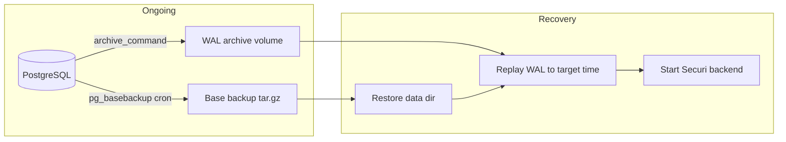

# Point-in-time recovery (PITR) runbook

Recover PostgreSQL to a specific timestamp between a **base backup** and continuous **WAL archives**. This is separate from daily `pg_dump` backups in `docs/BACKUP_AUTOMATION.md`.

## Recovery objectives

| Method | Typical RPO | Typical RTO | Use when |
|--------|-------------|-------------|----------|
| **pg_dump** (built-in scheduler) | Last backup (≤24h) | 30–120 min | Logical restore, migration, dev |
| **PITR** (WAL + base backup) | 1–15 min | 1–4 hours | Production incident, oops DELETE, ransomware |
| **Managed snapshot + PITR** | Provider-defined (often ≤5 min) | 15–60 min | RDS / Cloud SQL / Azure production |

SecuriSphere default Compose ships **pg_dump only**. Enable PITR via managed Postgres or the optional `docker-compose.pitr.yml` overlay.

## Architecture



**Important:** Plain SQL dumps from `pg_dump` cannot be replayed with WAL. PITR requires a **physical base backup** (`pg_basebackup`) plus archived WAL segments.

## Option A — Managed PostgreSQL (recommended production)

### Amazon RDS / Aurora

1. Enable **automated backups** and set **backup retention** (7–35 days).
2. Note the **latest restorable time** in the RDS console.
3. Restore:
   - **Same instance:** Restore to point in time → new instance → update `DATABASE_URL` → run Alembic if needed.
   - **Snapshot:** Create instance from snapshot (coarser than PITR).

```bash
aws rds restore-db-instance-to-point-in-time \
  --source-db-instance-identifier securi-prod \
  --target-db-instance-identifier securi-prod-pitr \
  --restore-time 2026-07-07T14:30:00Z
```

4. Point Securi at the new endpoint, verify `/health/ready`, run smoke tests.

### Google Cloud SQL

Enable **Automated backups** and **Point-in-time recovery** on the instance. Restore via console or:

```bash
gcloud sql instances clone securi-prod securi-prod-pitr \
  --point-in-time='2026-07-07T14:30:00Z'
```

### Azure Database for PostgreSQL

Use **Backup retention** + **Restore** → **Point-in-time restore** in Azure Portal.

### Checklist (managed)

- [ ] Backup retention meets compliance (≥7 days production)
- [ ] `DATABASE_URL` update documented for failover instance
- [ ] Secrets (`JWT_SECRET`, OIDC) unchanged — only DB endpoint changes
- [ ] Immutable audit chain still valid after restore (data restored as-is)
- [ ] Quarterly PITR drill to staging

---

## Option B — Self-hosted Docker with WAL archiving

### 1. Enable archiving

```bash
docker compose -f docker-compose.yml -f docker-compose.prod.yml -f docker-compose.pitr.yml up -d postgres
```

This mounts `deploy/postgres-pitr.conf` and volume `securi_wal_archive`.

Verify:

```bash
chmod +x scripts/pitr-check.sh
./scripts/pitr-check.sh
```

Expected: `archive_mode=on`, WAL segments accumulating in the archive volume.

### 2. Schedule base backups

Daily (after WAL archiving is stable):

```bash
# cron — 01:30 UTC
30 1 * * * /opt/securi/scripts/pitr-base-backup.sh >> /var/log/securi-pitr.log 2>&1
```

Keep base backups and WAL on **encrypted, off-site** storage (`docs/DB_ENCRYPTION_AT_REST.md`).

### 3. Stop writes before recovery

```bash
docker compose -f docker-compose.yml -f docker-compose.prod.yml stop backend worker frontend
```

Record the **target recovery time** in UTC (e.g. five minutes before the bad migration).

### 4. Restore base backup to a new data directory

**Destructive — use a staging host or new volume first.**

```bash
# Example paths — adjust for your host
BASE=data/pitr/base/base_20260707_013000.tar.gz
WAL_ARCHIVE_VOLUME=securi_wal_archive
NEW_PG_DATA=/var/lib/docker/volumes/securi_pg_data_restored/_data

mkdir -p "$NEW_PG_DATA"
tar -xzf "$BASE" -C "$NEW_PG_DATA"

# recovery configuration (PostgreSQL 12+)
cat >> "$NEW_PG_DATA/postgresql.auto.conf" <<EOF
restore_command = 'cp /var/lib/postgresql/wal_archive/%f %p'
recovery_target_time = '2026-07-07 14:30:00 UTC'
recovery_target_action = promote
EOF
touch "$NEW_PG_DATA/recovery.signal"
```

Swap volumes or point a recovery container at `NEW_PG_DATA` and the WAL archive mount.

Start Postgres in recovery mode; it replays WAL until `recovery_target_time`, then promotes.

### 5. Validate and bring up Securi

```bash
docker exec securi-postgres psql -U securi -d securi -c "SELECT max(timestamp) FROM events;"
docker compose -f docker-compose.yml -f docker-compose.prod.yml up -d
curl -s http://localhost:8000/health/ready
```

### 6. Post-recovery

- Document incident, recovery target, data loss window (events after target time are gone).
- Re-enable `BACKUP_ENABLED` and confirm `GET /api/v1/backups`.
- Optional: `GET /api/v1/audit/integrity` — chain should match restored data.

---

## Decision tree

```
Data loss incident?
├─ Yes, need restore to specific minute → PITR (managed or WAL)
├─ Yes, full replace from last night → pg_dump restore (BACKUP_AUTOMATION.md)
├─ No, migrate to new server → pg_dump or logical replication
└─ ransomware / disk failure → managed PITR or base+WAL from off-site
```

## Quarterly drill (staging)

1. Clone production backup to staging (never drill on prod).
2. Restore to `T-1h` and confirm event counts approximate expected.
3. Log into dashboard, open alerts, verify audit log loads.
4. Record RTO (time to ready) and gaps in runbook.

| Step | Owner | Target |
|------|-------|--------|
| Initiate restore | DBA / platform | ≤15 min |
| App health green | App on-call | ≤30 min after DB ready |
| SOC sign-off | Security lead | ≤60 min |

## What PITR does not restore

| Component | Action after DB PITR |
|-----------|-------------------|
| **Redis** | Ephemeral — job queue rebuilds |
| **OpenSearch** | Run `POST /api/v1/system/opensearch/backfill` if search backend is OpenSearch |
| **Agent API keys** | Unchanged in DB |
| **Docker volumes** (non-DB) | Not covered — backup `securi_backups` separately |

## Related

- [BACKUP_AUTOMATION.md](BACKUP_AUTOMATION.md) — daily `pg_dump` scheduler
- [DB_ENCRYPTION_AT_REST.md](DB_ENCRYPTION_AT_REST.md) — encrypt backup/WAL storage
- [DEPLOYMENT.md](DEPLOYMENT.md) — production Compose layout
- `docker-compose.pitr.yml` — optional WAL archiving overlay
- `scripts/pitr-check.sh` — verify archive_mode
- `scripts/pitr-base-backup.sh` — physical base backup
