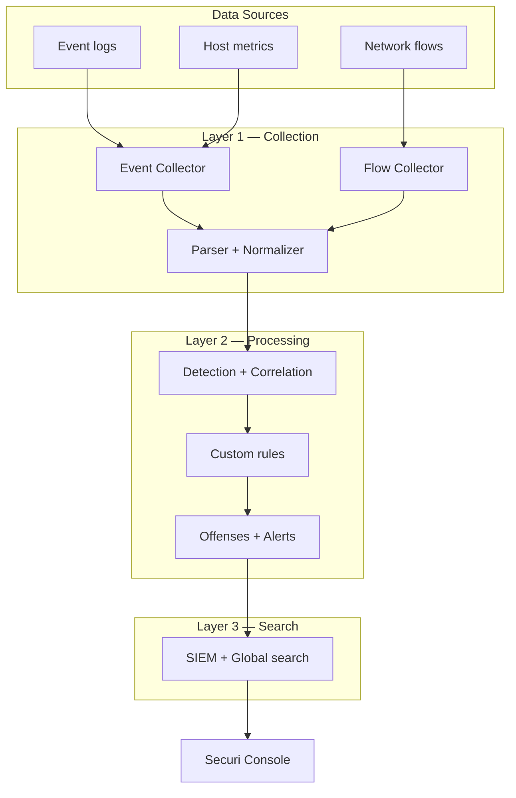

# Securi SIEM Pipeline (QRadar-style)

Securi follows the same **3-layer SIEM model** as IBM QRadar, adapted for a small Linux fleet.

## QRadar diagram → Securi

| QRadar | Securi | What it does |
|--------|--------------|--------------|
| **Event data** (firewall, syslog, Windows) | **Agent `POST /agent/events`** + **`POST /agent/windows-events`** | Host logs & Windows forwarder |
| **Flow data** (router, switch) | **Agent `POST /agent/flows`** | Network connection summaries |
| **Other data** (vuln scans, config) | Metrics, future integrations | Host metrics today; vuln feeds later |
| **Layer 1 — Collection** | `app/pipeline/ingestion.py`, `flow_collector.py`, `normalizer.py` | Parse, validate, normalize |
| **Layer 2 — Processing** | `processor.py`, detection, correlation, offenses | Rules, alerts, threat scores |
| **Layer 3 — Search** | `/search`, `/search/siem`, OpenSearch optional | Analyst queries |
| **Console** | Next.js dashboard | Graphs, alerts, offenses, reports |



## What you can do today

### 1. Send event logs (already works)

```bash
curl -X POST http://localhost:8000/api/v1/agent/events \
  -H "X-API-Key: YOUR_KEY" \
  -H "Content-Type: application/json" \
  -d '{"events":[{"event_type":"ssh_login_failure","severity":"high","timestamp":"2026-01-15T12:00:00Z","description":"Failed SSH"}]}'
```

### 2. Send network flows (new — QRadar Flow Collector equivalent)

```bash
curl -X POST http://localhost:8000/api/v1/agent/flows \
  -H "X-API-Key: YOUR_KEY" \
  -H "Content-Type: application/json" \
  -d '{"flows":[{"src_ip":"10.0.0.5","dst_ip":"8.8.8.8","src_port":44321,"dst_port":443,"protocol":"tcp","bytes_in":1200,"bytes_out":4096,"packets":12,"direction":"outbound","timestamp":"2026-01-15T12:00:00Z"}]}'
```

Flows are stored as `network_flow` events. Search with:

```
event_type:network_flow
source_ip:10.0.0.5
```

### 3. Forward Windows / Sysmon events (spike)

```bash
curl -X POST http://localhost:8000/api/v1/agent/windows-events \
  -H "X-API-Key: YOUR_KEY" \
  -H "Content-Type: application/json" \
  -d '{"events":[{"event_id":"4625","channel":"Security","message":"Failed logon","computer":"WIN-01","username":"admin","source_ip":"203.0.113.10","timestamp":"2026-01-15T12:00:00Z"}]}'
```

Windows event IDs are mapped to normalized types (e.g. `4625` → `ssh_login_failure`). Unknown IDs become `win_event_<id>`.

### 4. View pipeline status (admin)

`GET /api/v1/system/pipeline` — or open **System Health** in the dashboard.

## What this is used for

- **Collection** — ingest raw telemetry in a standard shape
- **Processing** — turn telemetry into alerts, offenses, timelines
- **Search** — let analysts hunt with SIEM field syntax
- **Console** — single pane for triage and reporting

## Not yet in Securi (full QRadar parity)

- Dedicated flow processor appliances
- Packet capture / forensics store
- Vulnerability scanner ingestion (Nessus/Rapid7)
- Building blocks / reference sets UI
- Multi-tenant collectors at scale

These are roadmap items; the 3-layer skeleton is in place.
